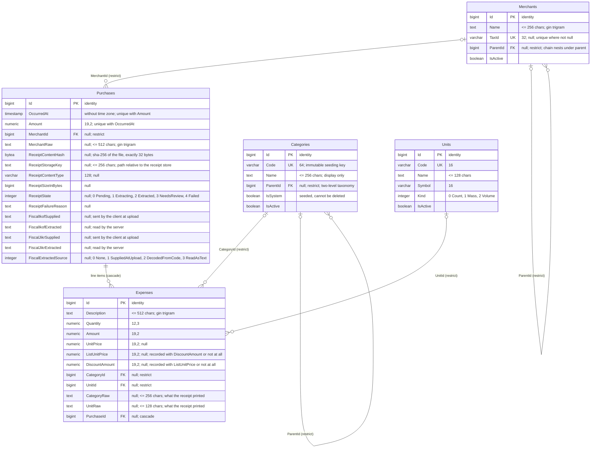

# Database schema

PostgreSQL. Generated from `Expenses.Infrastructure/Persistence/Configurations` and
`Migrations/` — currently through `20260828132914_PascalCaseIdentifiers`. Update this file when a
migration changes the shape.

**Tables and columns are PascalCase** and match the entity and property they map (D23), so
`Purchases.OccurredAt` is the `Purchase.OccurredAt` property and nothing is translated between the
code and a query. PostgreSQL folds an unquoted identifier to lower case, so hand-written SQL must
quote every one: `select "OccurredAt" from "Purchases"`, never `select occurred_at from purchases`.
Index and constraint names are the exception and stay lower snake_case behind their `ix_` / `ck_`
prefixes — nothing writes them by hand except a migration.

Five tables in two zones:

- **Ledger** — `Purchases`, `Expenses`. What a person confirmed. A purchase carries its receipt
  reference and extraction state inline, in its own columns.
- **Reference data** — `Categories`, `Units`, `Merchants`. Seeded, user-extensible, retired via `IsActive` rather than deleted.

There is no ingestion zone. Two things that used to be stored are not:

- **Receipt bytes.** They live in files under a configured receipt store. `Purchases` holds the
  reference to the file — hash, key, type, size — and never the content (D11). There is no
  `ReceiptImages` table: a receipt belongs to exactly one purchase, so it is columns on that row
  rather than a table joined to it.
- **What an engine proposed.** Extraction results and their candidate lines are transient and live
  only in process memory, keyed by purchase (D12).

All primary keys are `bigint` identity columns. All money is `numeric(19,2)`; all quantities are `numeric(12,3)`.

## Entity relationships

The `Receipt*` and `Fiscal*` columns are all null on a manually entered purchase and are set
together when a receipt is attached — `ck_purchases_receipt_all_or_nothing` is what makes "attached
or not" a single fact rather than six independent nullable ones.

## The receipt file store

The bytes of a receipt live in a file under a configured root directory. The purchase row is the
reference to it.

| Aspect | Rule |
| --- | --- |
| Layout | Content-addressed from the SHA-256: `<root>/<first two hex>/<next two hex>/<full hex><extension>`, and the whole relative path is stored verbatim in `ReceiptStorageKey` so the layout can change without rewriting history. |
| Extension | Derived from the sniffed content type, never from the uploaded file name. |
| Write order | File first, then the row — an atomic write to a temporary name followed by a rename, then the update. A file no purchase references is inert garbage; a purchase pointing at a file that was never written is the failure that ordering prevents. |
| Deduplication | Content addressing does it: identical bytes resolve to the same path and the second write is a no-op. Two purchases may therefore reference one file, which is why `ReceiptStorageKey` is **not** unique. |
| Deletion | The reference is cleared first, and the file is deleted afterwards, best effort, **only when no other purchase references the same `ReceiptContentHash`**. A shared file outlives the first purchase that referenced it. |
| Backup | The database dump alone is **not** a complete backup. The receipt store must be backed up beside it. |

## Uniqueness

| Index | Guarantees |
| --- | --- |
| `ix_purchases_occurred_at_amount` | The same amount cannot be recorded twice at the same instant — the duplicate-submission guard. |
| `ix_categories_code`, `ix_units_code` | Reference codes are the stable vocabulary, so renaming a name never breaks a reference. |
| `ix_merchants_tax_id` | Unique where `"TaxId" IS NOT NULL`; merchants without one are unconstrained. |

`ix_purchases_receipt_content_hash` is a plain, non-unique index: it exists so that "does any other
purchase still reference this file" is a lookup rather than a scan at deletion time.

## Check constraints

Each condition is the SQL as stored, quoting included — which is what a PascalCase column requires.

| Constraint | Condition |
| --- | --- |
| `ck_purchases_receipt_all_or_nothing` | Either every one of `"ReceiptContentHash"`, `"ReceiptStorageKey"`, `"ReceiptContentType"`, `"ReceiptSizeInBytes"` and `"ReceiptState"` is null, or none is |
| `ck_purchases_receipt_content_hash_length` | `"ReceiptContentHash" IS NULL OR length("ReceiptContentHash") = 32` |
| `ck_purchases_receipt_storage_key_length` | `"ReceiptStorageKey" IS NULL OR length("ReceiptStorageKey") <= 256` |
| `ck_purchases_merchant_raw_length` | `"MerchantRaw" IS NULL OR length("MerchantRaw") <= 512` |
| `ck_expenses_description_length` | `length("Description") <= 512` |
| `ck_expenses_category_raw_length` | `"CategoryRaw" IS NULL OR length("CategoryRaw") <= 256` |
| `ck_expenses_unit_raw_length` | `"UnitRaw" IS NULL OR length("UnitRaw") <= 128` |
| `ck_categories_name_length`, `ck_merchants_name_length` | `length("Name") <= 256` |
| `ck_units_name_length` | `length("Name") <= 128` |

## Fuzzy search

GIN indexes over `pg_trgm`:

| Index | Used for |
| --- | --- |
| `ix_expenses_description_trgm` | Finding a line item by a half-remembered product name. |
| `ix_merchants_name_trgm` | Matching a printed receipt header to a known merchant. |
| `ix_purchases_merchant_raw_trgm` | Searching purchases whose merchant was never resolved. |

## Delete behaviour

Deletes flow one way. Expenses cascade with their purchase, and the receipt reference goes with the
purchase row it lives on — no join, no restrict edge, nothing left behind in the database. Every
reference data link is `RESTRICT`: a category, unit or merchant that history points at cannot be
deleted, only deactivated. The receipt file is dealt with outside the transaction, under the
deletion rule above.
